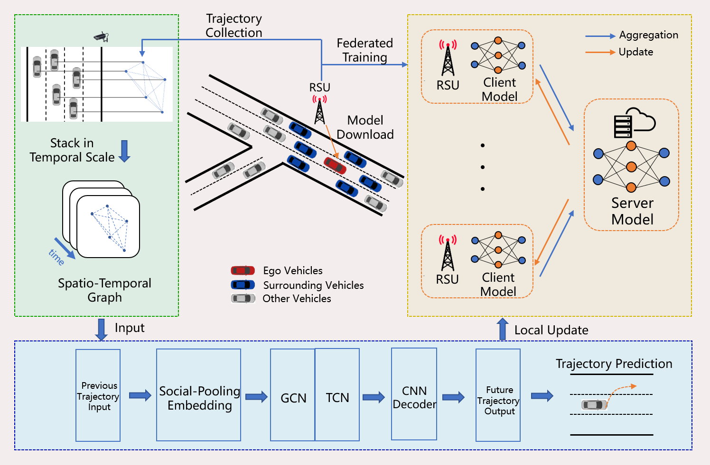
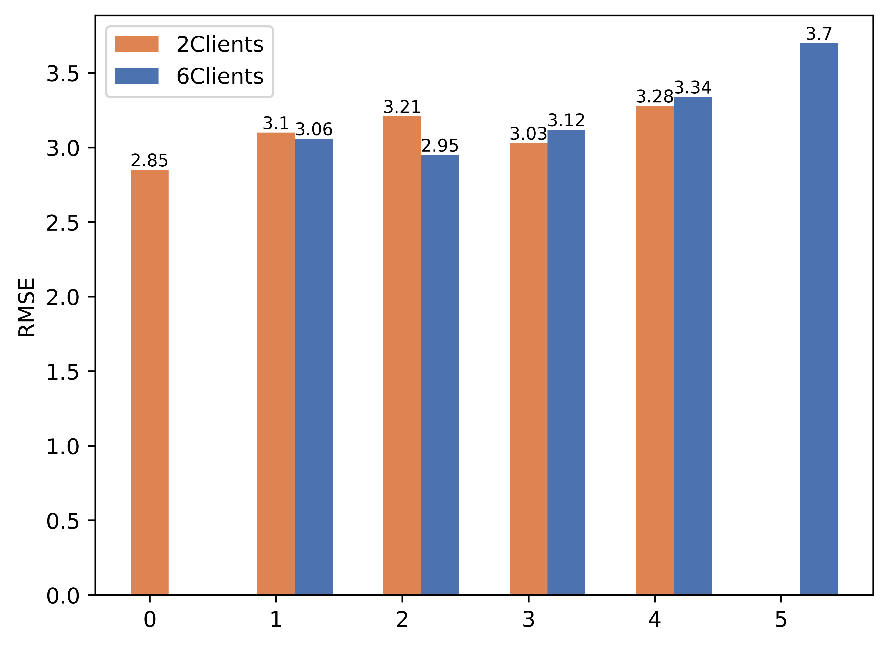
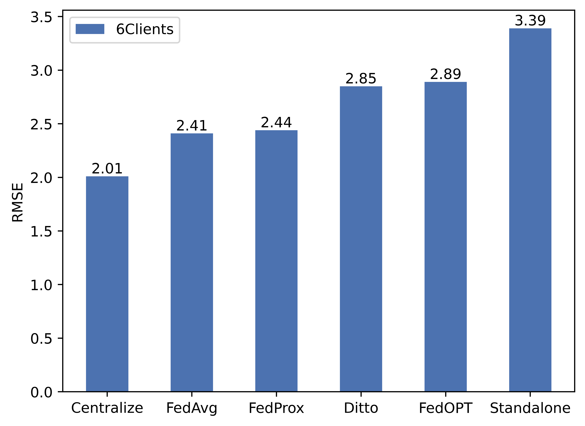
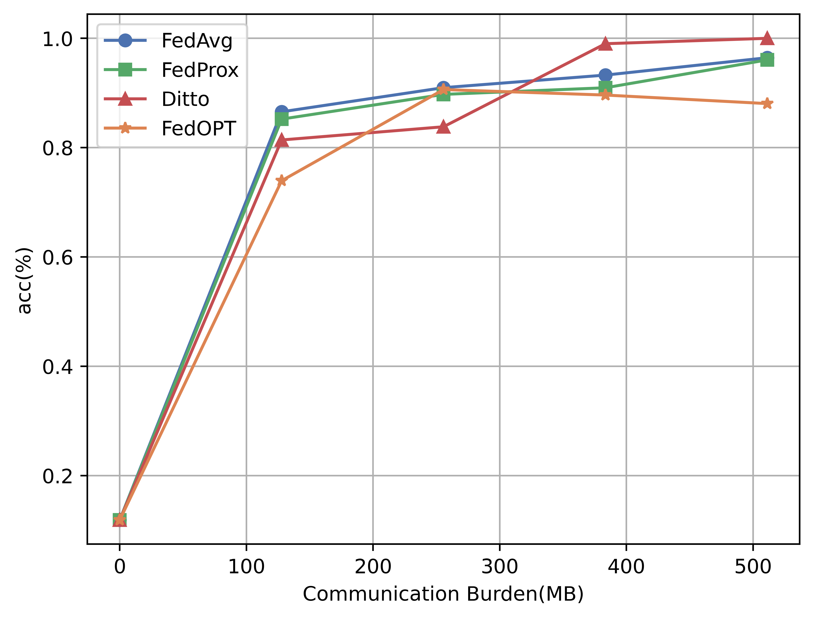
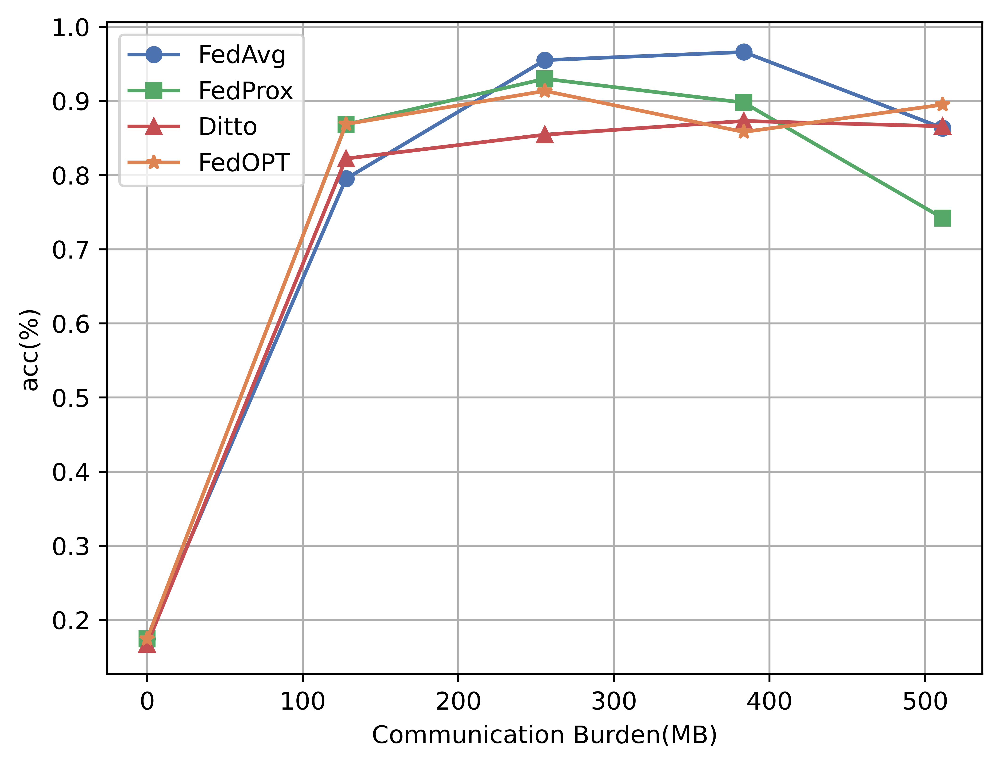

# FedVTP: Serverless Federated Learning Pipeline



## Abstract

Vehicle Trajectory Prediction (VTP) is crucial for motion planning and accident prevention in the Internet of Vehicles (IoV), but privacy and distributed data collection pose challenges. Prior FL solutions incur high communication overhead and lack a standardized benchmark. FedVTP builds upon existing federated learning research for VTP by introducing a **serverless architecture** using Knative and MinIO, transforming local training and aggregation into scalable cloud‐native functions while preserving data privacy.

## Architecture


Core components:

* **Driver** (`run_federated_rounds.py`): Orchestrates rounds by invoking clients, waiting for uploads in MinIO, and triggering aggregation.
* **Clients** (`system_trajectory/run_client.py`): RSU‐style clients train locally on the HighD dataset and push model + metadata to MinIO.
* **Server** (`system_trajectory/run_server.py`): Aggregates client updates via FedAvg, uploads new global model to MinIO.
* **MinIO**: Object storage for all model artifacts.
* **Knative**: Serverless serving for client & server, autoscaling, and eventing.

Architecture details are in `architecture.txt` (ASCII) and visualized in `fedvtp.png`.

## Scope of This Demo

* **Clients**: 2 Knative services (`fedvtp-client-0`, `fedvtp-client-1`)
* **Global Rounds**: 5 federated rounds
* **Dataset**: HighD vehicle trajectories
* **Mode**: CPU-only, no differential privacy

## Prerequisites

* Kubernetes cluster with Knative Serving & Eventing
* `kubectl` CLI
* `docker` (optional to rebuild images)
* MinIO deployed in `default` namespace
* (Optional) `mc` CLI for MinIO inspection

## Installation

Install conda environment:

```bash
conda env create -f environment.yml
conda activate fedvtp
```

## Dataset

Download NGSIM and HighD datasets from their official sites. Preprocess using tools in `/dataset` as needed.

## Running Base Experiments

Train models directly (non-serverless):

```bash
python system_trajectory/train.py \
  -data NGSIM -m stgcn -go stgcn -algo FedAvg -nc 6 -ls 3 -jr 1 -lbs 128 -gr 1000 -stg 3 -txp 5

python system_trajectory/train.py \
  -data HIGHD -m stgcn -go stgcn -algo FedAvg -nc 6 -ls 3 -jr 1 -lbs 128 -gr 1000 -stg 3 -txp 5
```

Models are saved under `/models/<dataset>/...`.

## Running Federated Rounds (Serverless)

By default, 2 clients over 5 rounds:

1. **Build & push driver image** (or use published):

   ```bash
   docker build -f Dockerfile.rounds -t farmonovasad/fedvtp-rounds:v9 .
   docker push farmonovasad/fedvtp-rounds:v9
   ```
2. **Create MinIO credentials secret**:

   ```bash
   kubectl create secret generic minio-creds \
     --from-literal=accesskey=<ACCESS_KEY> \
     --from-literal=secretkey=<SECRET_KEY>
   ```
3. **Deploy MinIO Service**:

   ```bash
   kubectl apply -f knative/minio-service.yaml
   ```
4. **Deploy Knative client & server**:

   ```bash
   kubectl apply -f knative/service_client_0.yaml
   kubectl apply -f knative/service_client_1.yaml
   kubectl apply -f knative/service_server.yaml
   ```
5. **Launch the federated-rounds Job**:

   ```bash
   kubectl apply -f job_rounds.yaml
   ```

## Monitoring & Logs

* **Driver**:

  ```bash
  kubectl logs -f job.batch/run-federated-rounds
  ```
* **Clients**:

  ```bash
  kubectl logs -f -l serving.knative.dev/service=fedvtp-client-0
  kubectl logs -f -l serving.knative.dev/service=fedvtp-client-1
  ```
* **Server**:

  ```bash
  kubectl logs -f -l serving.knative.dev/service=fedvtp-server
  ```

## Inspecting Models in MinIO

Configure `mc`:

```bash
mc alias set local http://minio.default.svc.cluster.local:9000 <ACCESS_KEY> <SECRET_KEY>
mc ls local/fedvtp-models/global
mc ls local/fedvtp-models/clients/round_1
```

## Cleanup

```bash
kubectl delete job run-federated-rounds
kubectl delete ksvc fedvtp-client-0 fedvtp-client-1 fedvtp-server
kubectl delete secret minio-creds
```

## License

MIT License — see [LICENSE](LICENSE) for details.

## Result
### Federated performance in NGSIM and HighD dataset

 | 
---|---

### Communication in NGSIM and HighD dataset

 | 
---|---
